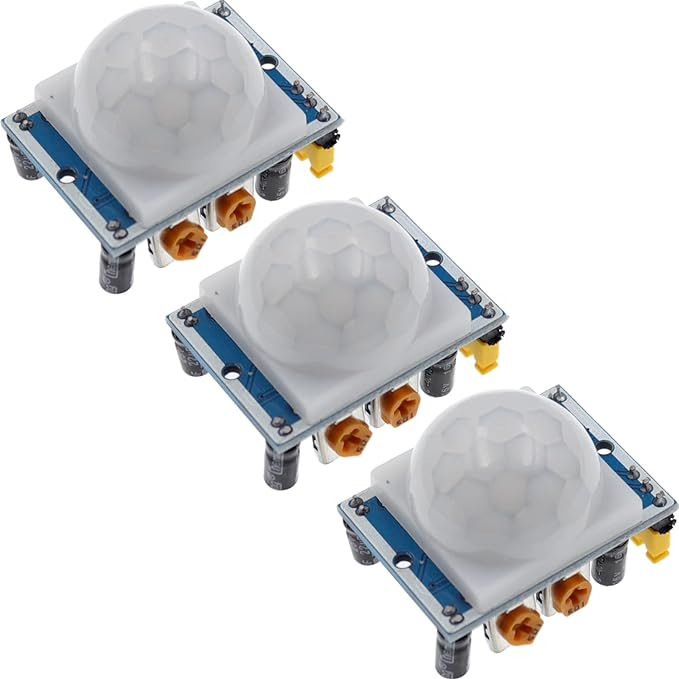
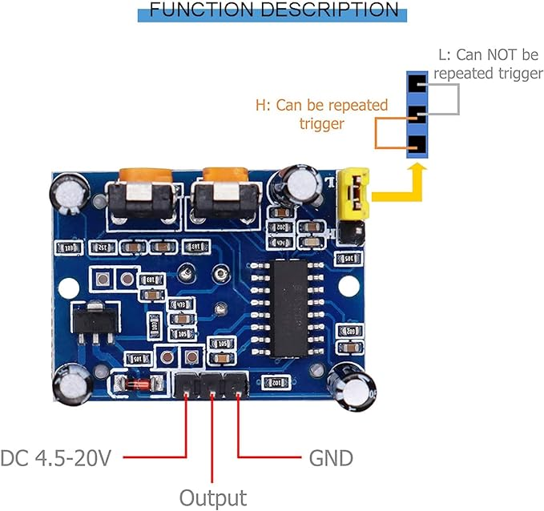

This repo is code source for gathering data of:
1. plant activity (time-voltage) time series
2. passive infrared (pir) motion sensor data

pir example: 
[amazon japan link](https://www.amazon.co.jp/-/en/HC-SR501PIR-Infrared-Detector-Mounting-RaspberryPi/dp/B09WVDYZMP/ref=sr_1_57?crid=19GGG4VFT6JT7&dib=eyJ2IjoiMSJ9.xCkvXyJnQr4gSjJhrScX-xB153vmaKlUkgOBKnIu42Wk_hgMeNN1nnxWOS8D_9DHNTFSwIskaLiQrFqRJEoL2bgiGbPh9TEih17cR9TuuQw.k2c-X25K2pbUx3IyM-fgS2ZP5wnYIWWOLLc9spCFNpI&dib_tag=se&keywords=pir&qid=1710408634&sprefix=pir%2Caps%2C164&sr=8-57)

# Target 
Correlation research of time series of plant activity and motion sensor data 

# Construct
1. Attach plant electrodes to leaf and ground
2. Connect electrodes to oscilloscope (GRAPHTEC GL900)
3. Connect Oscilloscope (GRAPHTEC GL900) to laptop via USB cable

4. Connect pir motion sensor to Raspberry PI (signal, power, ground)
Note GPIO number of Raspberry pi used for signal
pir pinout:

Raspberry Pi pinout:

# Gather dataset

On RasberryPi:
1. open bash terminal
2. cd /home/renas/pythonprog_rasp (move to raspberry record script folder)
3. Start gather: python3 pir.py (code of pir.py is pir(rasp_record) in this repo)
4. Stop gather: ctrl+c
5. On raspberry pi on the same directory the file would be created (*start_datetime*pir_log.txt)
6. Copy pir_log.txt file where data is as datetime list of motion sensor triggers by motion

On laptop (arumik):
7. connect to Oscilloscope and start 'GL-900APS' program (C://program_files(x86)/Gpaphtec/GL-900APS.exe)
and start collecting dataset through its interface

8. Stop gather by 'GL-900APS' program interface
9. Copy dataset from Documents/Graphtec/GL900APS/Data  

Visualize this data:
oscillo_plot.py     - Oscilloscope matplotlib.plt

pir_plot.py         - Motion Sensor data matplotlib.plt

pir_plot_pdf.py     - Motion Sensor data as a generated pdf file

pir+oscillo_plot.py - Oscilloscope and Motion sensor data matplotlib.plt 

# Analyze workflow

1. Create a new folder for data
2. Add Oscillo voltage data .csv
3. Add PIR data covered in time Oscillo data fully (This data expected to be gathered with pir(rasp_record).py)
4. Make a dataset with data_preprocessing.py
data_preprocessing make sampling from large time series to samples of affected(first half of sample has motion sensor trigger)/not affected (no motion sensor trigger during all sample time) plant's activity  
5. ML experiments. For example: transformer.py 

# Datasets

dataset/2023-11-29 (7 days) 
1. *pir_log.txt - pir motion sensor data
2. *.CSV - GL-900APS plant's activity data
3. labeled_data.pth - data sampled for binary classification by data_preprocessing.py

dataset/05.12_dataset (7 days)
1. *pir_log.txt - pir motion sensor data
2. *.CSV - GL-900APS plant's activity data
3. labeled_data.pth - data sampled for binary classification by data_preprocessing.py

dataset/2023-10-19 (10 minutes for testing)
dataset/2023-09-27 (1 day for testing)

v 20.03.2024
